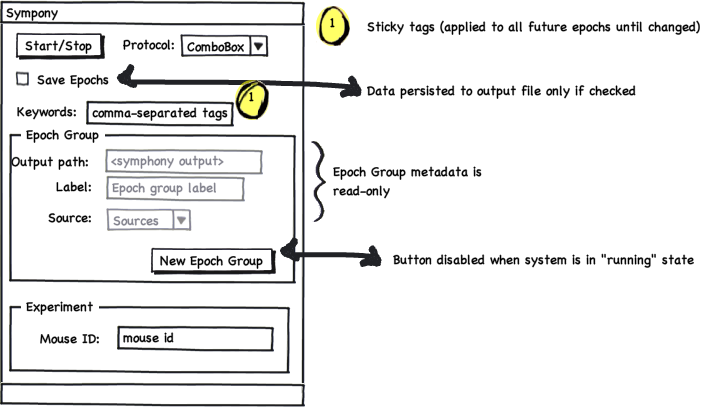
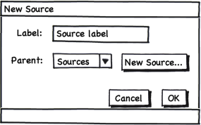
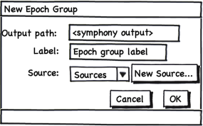
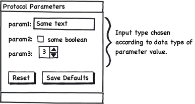
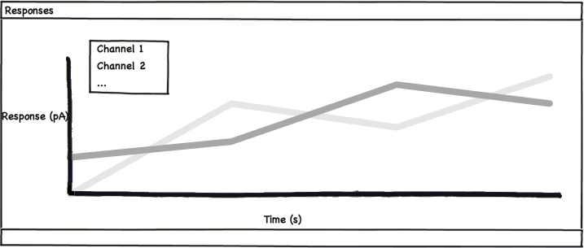

.. Copyright (c) 2011 Physion Consulting LLC

==========
Matlab GUI
==========

The Matlab GUI will provide a simple interface for selecting experiment protocol, modifying the parameters of that protocol and displaying incoming results and (optional) online analysis.

The UI consists of three main components, described in the following sections.

.. _main-ui-controls-section:

Main UI Controls
****************

These controls allow the user to specify experiment metadata and output path, experimental protocol and allow the user to start and stop acquisition.

.. main-ui-controls-figure:

    The main UI controls.
    
The "New Epoch Group" button should be disabled when the system is in the "running" state.

The "New Source" button should bring up a modal dialog, as shown in the figure below, to allow the user to create a Source instance, optionally setting the parent of the Source to an existing source instance.

.. new-source-figure:

    Modal "New Source" dialog.
    
Similarly, the "New Epoch Group" button should bring up a modal dialog, as shown in the figure below, with input for the parameters of the new EpochGroup.

.. new-epoch-group-figure:

    Modal "New Epoch Group" dialog.

Protocol parameters UI
**********************

Upon selecting a protocol from the Main UI controls' "Protocol" popup menu, the system shall display a UI for setting values for the selected protocol's parameters. This UI should be automatically generated from the field names and value types of the protocol parameters ``struct`` for a given protocol. An example UI is shown below for a protocol with parameters labeled "param1", "param2", and "param3".

.. protocol-parameters-ui-figure:

    Example protocol parameters UI for a protocol with three parameters ("param1", "param2", "param3")

The "Reset" and "Save Default" buttons should be present for all protocols. The "Reset" button will reset parameter values to the stored default for the current protocol. "Save Default" will save the current values as the default for the current protocol.

Current values for the protocol should persist for the lifetime of the GUI application. Thus, if the user changes a parameter value, switches to a different protocol and then returns to the first protocol, the changed parameter value should still be present in the first protocol's parameter values.

Results display
***************

System should display the recorded results from each Epoch up completion of the Epoch. This display may use simple Matlab plotting to display 1-D results and images.

.. results-display-ui-figure:

    
    A simple figure for displaying the results of the most recently recorded Epoch.
    

    