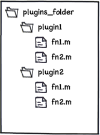

.. Copyright (c) 2011 Physion Consulting LLC

.. _plugin-discovery-chapter:

================
Plugin Discovery
================

Protocol "plugins" for the Symphony Matlab GUI are a collection of required functions, specified in the :ref:`protocol-api-chapter` chapter. The name of the plugin folder may be taken as the plugin name for display in the UI. The system should automatically discover available plugins at runtime. The method of discovery of available plugins is up to implementor, but a suggestions follows.

The Symphony GUI may specify a particular folder for containing plugins and all folders in the specified folder will be assumed to be contain protocol plugins. Matlab path manipulation could be used to select the current plugin. For example, given a file system hierarchy like that show in the figure below, the Matlab path to contain ``plugins_folder/plugin1`` would make ``fn1`` and ``fn2`` from ``plugin1`` "active". The active plugin could be changed to ``plugin2`` by removing ``plugins_folder/plugin1`` from the Matlab path and adding ``plugins_folder/plugin2`` to the path.

.. _plugin-discovery-fig:

    Example file system hierachy showing two plugin folders (``plugin1`` and ``plugin2``).